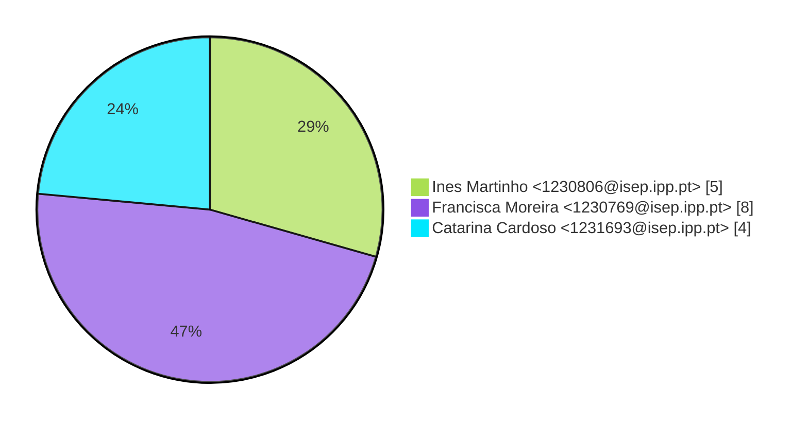
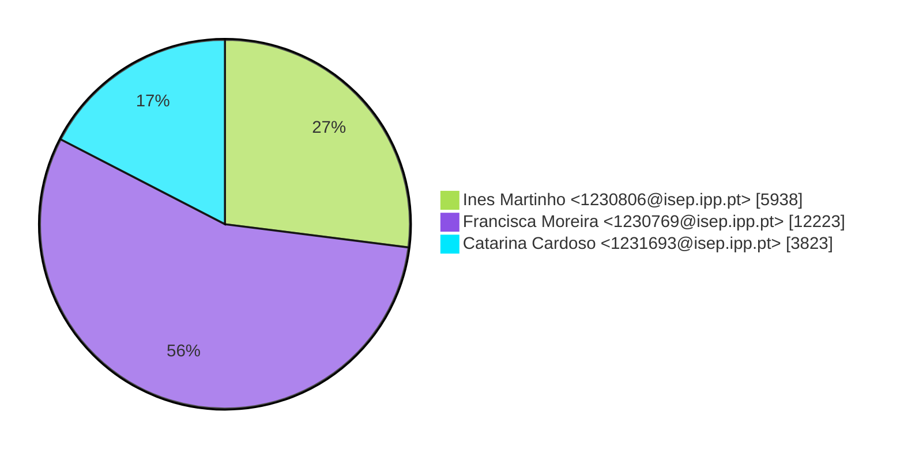
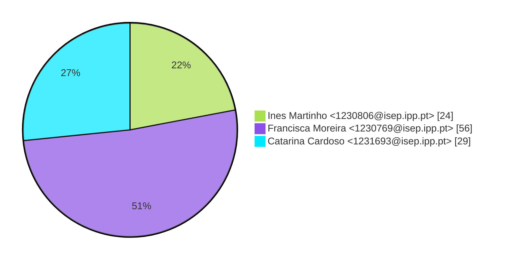

# Contribution stats by author 
|author|insertions|insertions_per|deletions|deletions_per|files|files_per|commits|commits_per|lines_changed|lines_changed_per|
|---|---|---|---|---|---|---|---|---|---|---|
| Ines Martinho <1230806@isep.ipp.pt>|3677|20%|2261|57%|24|22%|5|29%|5938|27%|
| Francisca Moreira <1230769@isep.ipp.pt>|10677|59%|1546|39%|56|51%|8|47%|12223|56%|
| Catarina Cardoso <1231693@isep.ipp.pt>|3640|20%|183|5%|29|27%|4|24%|3823|17%|

## Commits percentage

## Lines changed

## Files changed

