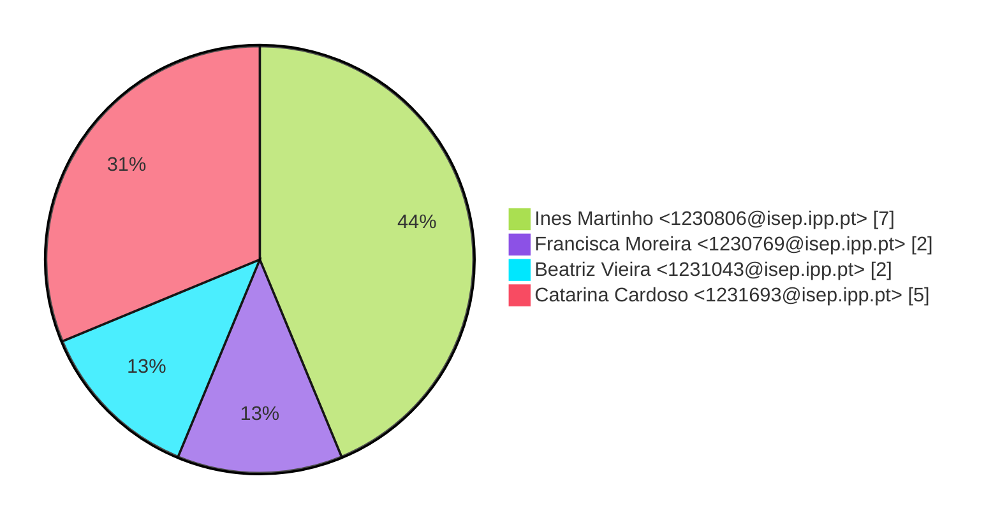
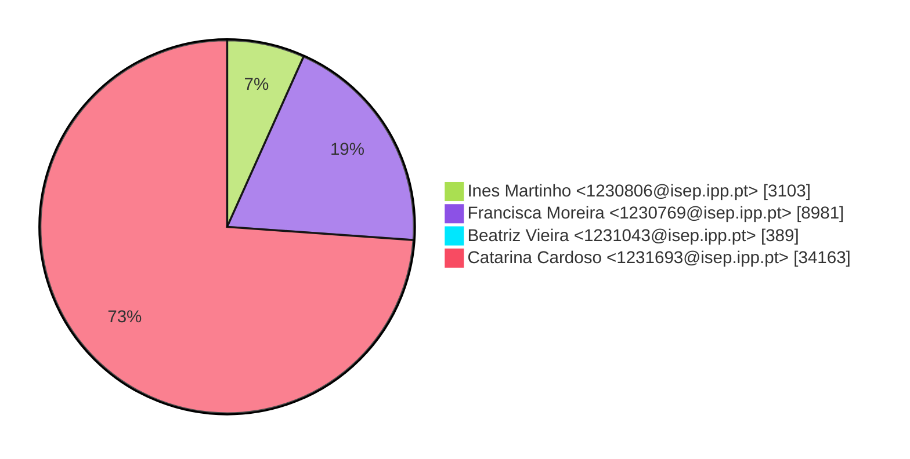
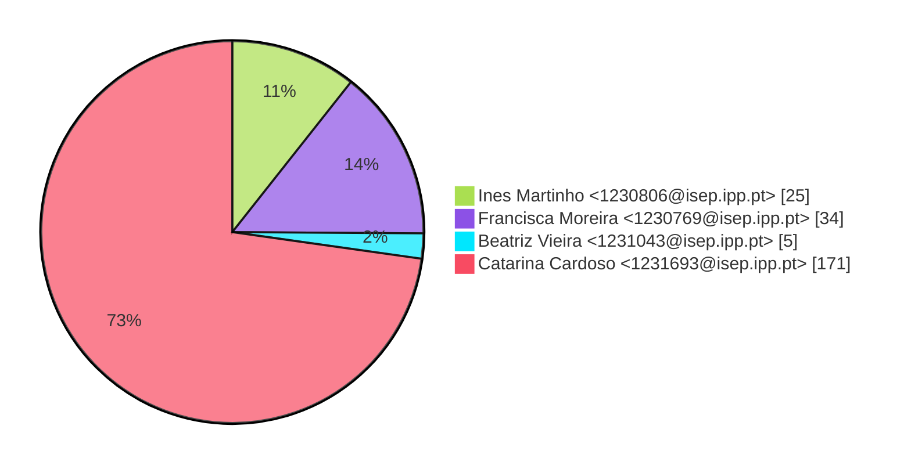

# Contribution stats by author 
|author|insertions|insertions_per|deletions|deletions_per|files|files_per|commits|commits_per|lines_changed|lines_changed_per|
|---|---|---|---|---|---|---|---|---|---|---|
| Ines Martinho <1230806@isep.ipp.pt>|2555|6%|548|16%|25|11%|7|44%|3103|7%|
| Francisca Moreira <1230769@isep.ipp.pt>|6476|15%|2505|74%|34|14%|2|12%|8981|19%|
| Beatriz Vieira <1231043@isep.ipp.pt>|376|1%|13|0%|5|2%|2|12%|389|1%|
| Catarina Cardoso <1231693@isep.ipp.pt>|33824|78%|339|10%|171|73%|5|31%|34163|73%|

## Commits percentage

## Lines changed

## Files changed

